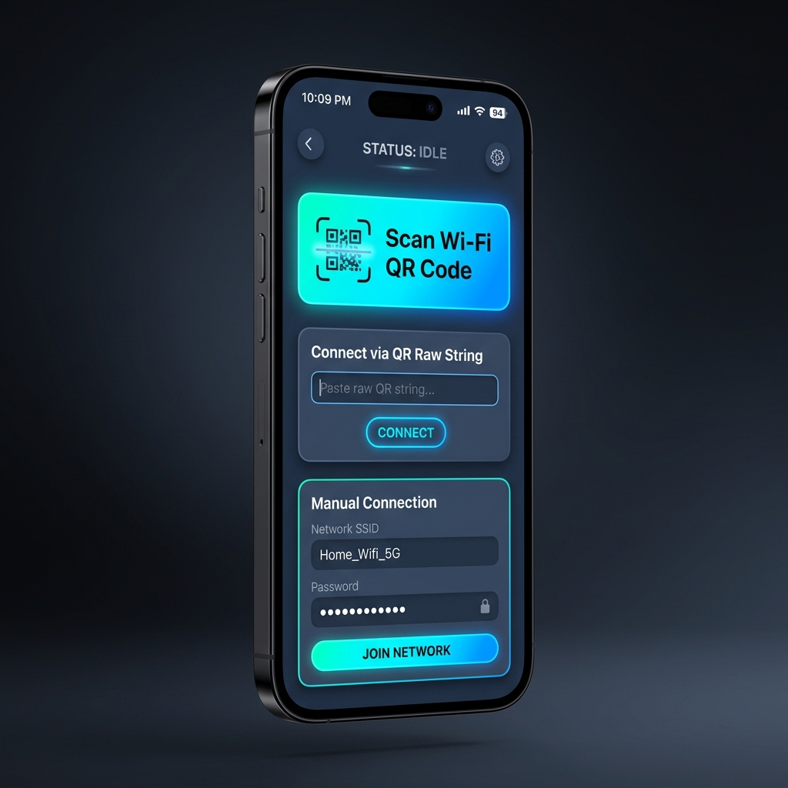

# wifi_connector_plus

[](https://pub.dev/packages/wifi_connector_plus)
[](https://pub.dev/packages/wifi_connector_plus)
[](https://pub.dev/packages/wifi_connector_plus)

Current stable release: `0.0.2`

A comprehensive Flutter plugin to scan Wi-Fi QR codes, parse connection settings, and connect directly to Wi-Fi networks.

<p align="center">
  
</p>

> [!IMPORTANT]
> This plugin only supports **Android** and **iOS** platforms.

## Features

- **Built-in Scanner Widget**: `WifiQrScannerView` handles camera permission requests, displays the camera view with an overlay, and parses Wi-Fi configurations automatically.
- **Manual Connections**: Establish connections manually using SSID, password, and security types (WPA, WEP, or Open/None).
- **QR Code Parser**: Standalone utility `WifiQrParser` to parse industry-standard Wi-Fi QR configurations (e.g., `WIFI:S:MyNetwork;T:WPA;P:SecretPassword;;`).
- **Comprehensive Platform APIs**: Uses modern native connection APIs (`WifiNetworkSpecifier` and `WifiNetworkSuggestion` on Android 10+, and `NEHotspotConfigurationManager` on iOS 11+).

---

## Getting Started

### 1. Platform Setup & Permissions

<details>
<summary><b>Android Setup</b></summary>

Add the following permissions to your `android/app/src/main/AndroidManifest.xml`:

```xml
<manifest xmlns:android="http://schemas.android.com/apk/res/android">
    <!-- Camera permission for the QR Scanner -->
    <uses-permission android:name="android.permission.CAMERA" />
    
    <!-- Location and Wi-Fi state permissions for connecting to networks -->
    <uses-permission android:name="android.permission.ACCESS_FINE_LOCATION" />
    <uses-permission android:name="android.permission.ACCESS_COARSE_LOCATION" />
    <uses-permission android:name="android.permission.CHANGE_WIFI_STATE" />
    <uses-permission android:name="android.permission.ACCESS_WIFI_STATE" />
    
    <application ...>
        ...
    </application>
</manifest>
```

#### Android Configuration Requirements:
- **Location Services**: Location services must be enabled on the target device for Wi-Fi network scanning and connection APIs to function correctly on newer Android versions.
- **Runtime Permissions**: Make sure to check/request location and camera permissions dynamically at runtime before triggering connection or scanning logic.
  - The plugin provides `isLocationPermissionGranted()` and `requestLocationPermission()` helper methods for this purpose.
  - The `connect()` method automatically performs a pre-check on Android and returns a `WifiConnectError.permissionDenied` failure if location permission is not granted.
  - `WifiQrScannerView` automatically checks and requests the camera permission.
</details>

<details>
<summary><b>iOS Setup</b></summary>

Add the following keys to your `ios/Runner/Info.plist`:

```xml
<key>NSCameraUsageDescription</key>
<string>This app needs camera access to scan QR codes for Wi-Fi connections.</string>
<key>NSLocationWhenInUseUsageDescription</key>
<string>This app needs location access to detect nearby Wi-Fi networks.</string>
```

#### iOS Capabilities & Entitlements:
1. **Hotspot Configuration**:
   - Open the iOS project (`ios/Runner.xcworkspace`) in Xcode.
   - Select your project in the project navigator, then select your application target under **Targets**.
   - Go to the **Signing & Capabilities** tab.
   - Click **+ Capability** in the top left, search for **Hotspot Configuration**, and add it.
   - *This capability is mandatory for `NEHotspotConfigurationManager` to function without permission errors.*
2. **Access Wi-Fi Information** *(Optional/Recommended)*:
   - If you need to access details about the current Wi-Fi network (such as the SSID), add the **Access Wi-Fi Information** capability in the **Signing & Capabilities** tab.
</details>

---

## Usage

### 1. Connecting to Wi-Fi Manually

```dart
import 'package:wifi_connector_plus/wifi_connector_plus.dart';

final wifiConnector = WifiConnectorPlus();

// Connect manually to a WPA network
WifiConnectResult result = await wifiConnector.connect(
  ssid: 'MyHomeWiFi',
  password: 'myPassword123',
  securityType: WifiSecurityType.wpa, // WPA, WEP, or None
  isHidden: false,
);

if (result.isSuccess) {
  print('Connected successfully: ${result.message}');
} else {
  print('Connection failed: ${result.message} (Error: ${result.error})');
}
```

### 2. Parsing a raw Wi-Fi QR Code String

```dart
import 'package:wifi_connector_plus/wifi_connector_plus.dart';

final rawQrString = 'WIFI:S:OfficeWiFi;T:WPA;P:Secret123;;';
WifiCredentials? credentials = WifiQrParser.parse(rawQrString);

if (credentials != null) {
  print('SSID: ${credentials.ssid}');
  print('Password: ${credentials.password}');
  print('Security: ${credentials.securityType}');
}
```

### 3. Using the built-in Camera QR Scanner Widget

Push `WifiQrScannerView` to display a camera view that requests permissions and parses Wi-Fi configurations automatically.

```dart
import 'package:flutter/material.dart';
import 'package:wifi_connector_plus/wifi_connector_plus.dart';

class ScannerScreen extends StatelessWidget {
  const ScannerScreen({super.key});

  @override
  Widget build(BuildContext context) {
    return Scaffold(
      body: WifiQrScannerView(
        onScanSuccess: (WifiCredentials credentials, String rawValue) async {
          // Triggered when a valid Wi-Fi QR code is scanned
          Navigator.pop(context);
          
          final connector = WifiConnectorPlus();
          final result = await connector.connect(
            ssid: credentials.ssid,
            password: credentials.password,
            securityType: credentials.securityType,
            isHidden: credentials.isHidden,
          );
          
          print('Connection Result: ${result.message}');
        },
        onError: (String error) {
          // Triggered if permissions are denied or scanning fails
          print('Scanner Error: $error');
        },
      ),
    );
  }
}
```

### 4. Checking and Requesting Location Permissions

On Android, location permissions are mandatory for Wi-Fi connection operations. You can utilize the built-in helper methods to check and request location permissions:

```dart
final wifiConnector = WifiConnectorPlus();

// Check if location permission is granted
bool isGranted = await wifiConnector.isLocationPermissionGranted();

if (!isGranted) {
  // Request location permission
  bool hasGranted = await wifiConnector.requestLocationPermission();
  if (hasGranted) {
    print("Location permission granted by user.");
  } else {
    print("Location permission denied by user.");
  }
}
```

> [!NOTE]
> The `connect` method performs an automatic location permission check on Android prior to starting the Wi-Fi connection and returns a descriptive error state if not granted.

---

## Contributing

Contributions are welcome! If you find any bugs, have feature requests, or want to improve the codebase, feel free to open an issue or submit a pull request.

## License

This project is licensed under the MIT License - see the [LICENSE](LICENSE) file for details.

Third-party package dependencies are subject to their respective licenses. See [THIRD_PARTY_NOTICES.md](THIRD_PARTY_NOTICES.md) for details.

Created and maintained by [handelika](https://github.com/handelika).
